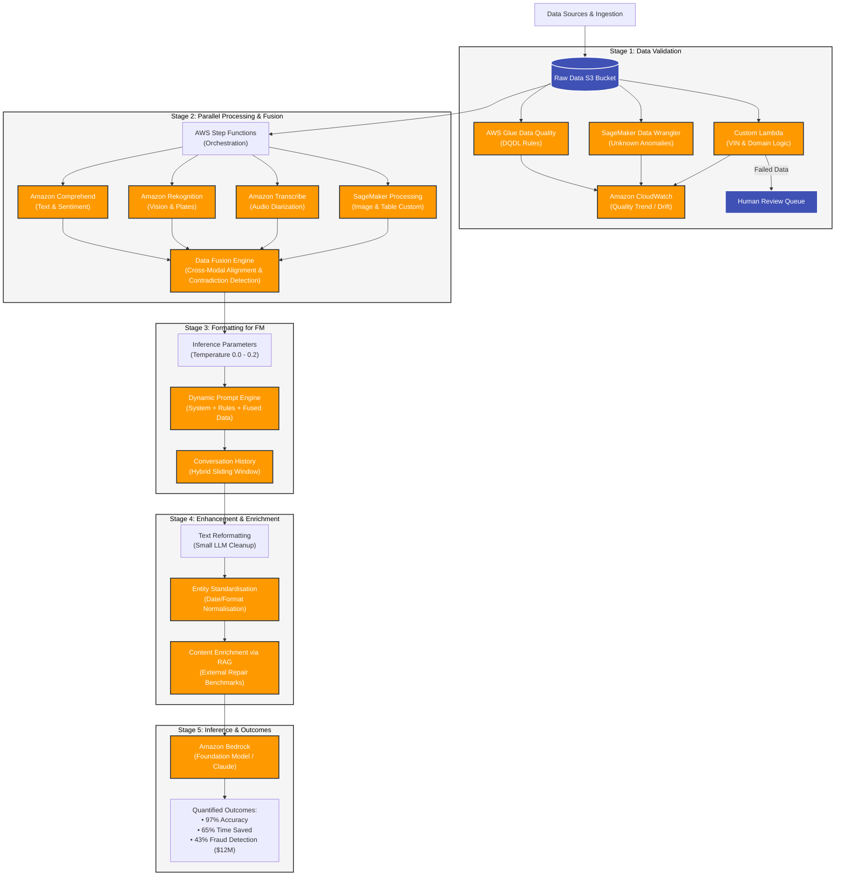

Task 1.3: Comprehensive End-to-End Data Pipeline Architecture
1. Context and High-Level Architecture Overview
In an enterprise insurance modernization project processing over 5,000+ complex claims daily, the architecture deals with multimodal data (Tabular forms, Images, Audio, and Historical records).
The primary architectural challenge is that Foundation Models (FMs) cannot process raw, unvalidated, or unstructured data directly. Doing so would lead to severe data hallucinations, token wastage, security vulnerabilities (such as unmasked PII), and massive latency issues. Therefore, an end-to-end pipeline consisting of five distinct sequential stages must be established before any data reaches Amazon Bedrock.
Plaintext
Raw Data Sources -> 1. Validation -> 2. Processing & Fusion -> 3. Formatting -> 4. Enhancement & Enrichment -> 5. Bedrock Inference

Stage 1: Data Validation (The First Line of Defense)
In Generative AI, the golden rule is "Garbage in, garbage out." However, the danger with LLMs is far worse than traditional software: an LLM will take flawed, corrupted, or incorrect input and generate a completely false answer with absolute confidence and a smooth, convincing tone. If a bad policy number or inflated claim amount slips through, it results in erroneous financial payouts.
To prevent this, four distinct validation tools are deployed. They do not compete; instead, each catches what the others miss:
AWS Glue Data Quality (Known Unknowns):
What it does: Performs automated, rule-based checks on structured tabular data using DQDL (Data Quality Definition Language). It runs continuously in the background of the data pipeline.
Detailed Example: It checks rules such as: "Does the policy number string strictly match the regex pattern POL-#####?", "Is the claimed damage date strictly within the active coverage window of the policy?", or "Is the claim amount below the maximum insured limit?" If a rule fails, the record is immediately intercepted.
SageMaker Data Wrangler (Unknown Unknowns):
What it does: A visual, interactive data exploration tool used primarily during the initial engineering setup to discover hidden structural flaws, distributions, and legacy data quirks.
Detailed Example: When onboarding an acquired legacy insurance database, engineers run Data Wrangler and discover via visual distributions that historical policy numbers were stored with random trailing spaces or missing alphanumeric prefixes. No pre-written code would catch this because engineers didn't even know the legacy format was inconsistent until seeing the visualization.
Custom Lambda Validation (Domain Logic & Cross-Modal Integrity):
What it does: Executes specialized business logic that off-the-shelf automated database tools cannot comprehend.
Detailed Example: A managed service cannot verify whether a vehicle identification number (VIN) matches the specific make and model declared in the text form. A custom Lambda script queries an external vehicle specifications database to confirm that the VIN corresponds precisely to a 2021 Honda Civic. If the VIN actually belongs to a commercial truck, Lambda flags it.
Amazon CloudWatch (Quality Trend Monitoring):
What it does: Monitors data quality metrics continuously over time rather than evaluating batches in isolation.
Detailed Example: If the system's overall daily validation pass rate starts drifting downward across batches—moving from 94% to 91%, and then hitting 87%—CloudWatch automatically triggers a critical alert. This signals to the engineering team that an upstream system changed its data export format without prior notice.
Crucial Rule on Failure: Data that fails validation is never silently discarded. Instead, it is routed safely into a Human Review Queue for manual adjuster intervention.

Stage 2: Data Processing & Fusion (Parallel Handling & Contradiction Detection)
Because claims arrive simultaneously across four disparate modalities, running them sequentially through a single thread would bottleneck the system and cause severe latency. Parallel processing via an enterprise orchestrator is mandatory.
AWS Step Functions (The Resilient Orchestrator):
Why not Lambda? AWS Lambda has a strict 15-minute execution timeout limit. Long-running customer phone call audio files sent to Amazon Transcribe would easily breach this limit and crash a Lambda function.
The Step Functions Advantage: Step Functions acts as the master coordinator. It triggers parallel child branches, handles retries per branch, waits natively for all branches to complete, provides complete visual execution histories, and integrates seamlessly with long-running asynchronous managed services without timing out.
Modality-Specific Processing Engines:
Text (Amazon Comprehend): Extracts natural language entities, language types, and performs sentiment analysis. For instance, detecting extreme customer anger or agitation within a call transcript acts as an immediate metadata flag for potential fraud.
Images (Amazon Rekognition & SageMaker Processing): Rekognition performs generic vision tasks like reading license plates and checking image sharpness. Meanwhile, SageMaker Processing handles heavier custom jobs—such as resizing, cropping, and running specialized damage-severity classification models to prep images for the FM.
Audio (Amazon Transcribe Call Analytics): Converts raw voice streams into text while providing specialized contact-center insights, including speaker diarization (separating the adjuster's voice from the customer's voice) and tracking interruptions or talk-to-listen ratios.
Data Fusion (The Pinnacle of Fraud Detection):
Processing modalities individually only gives isolated data points. Fusion is the architectural process of binding them together into a unified context structure.
The Contradiction Detection Example:
Tabular Claim Form: States "Front-end bumper damage."
Image Processing (Rekognition): Photo #4 shows a completely pristine front bumper, but severe crumpling on the rear bumper.
Audio Transcription: The customer states on the call, "Someone rear-ended me at the red light."
Result: When these disparate streams fuse together, the system flags a glaring contradiction. The form is wrong, and the pattern strongly suggests staging or fraud. This multi-modal fusion logic drove a 43% improvement in fraud detection accuracy and saved millions.
Stage 3: Formatting Input Data for FM Inference
Once data is clean and fused into a structured JSON payload, it must be formatted for the Foundation Model hosted on Amazon Bedrock.
The Three Inference Parameters Explained:
Temperature (0.0 to 1.0): Controls the mathematical randomness of token selection.
Why Insurance uses 0.0 to 0.2: In financial assessments, you want strict determinism. If a claim is evaluated today, running it through the model tomorrow must yield the exact same legal and financial conclusion. High temperature introduces creative drift, which is disastrous here.
Top_P (Nucleus Sampling): Controls the cumulative probability threshold of token pools (e.g., considering only the top 10% most likely words).
The Golden Rule ("Tune either Temperature or Top_P, never both"): Both parameters manipulate token probability distribution. If you change both simultaneously, the effects overlap and conflict, making it mathematically impossible to debug why the model's output behavior shifted. Pick one (typically locking Temperature) and leave the other at default.
Max_Tokens: Restricts the length of the output generation only (not the input payload). If set too low, complex claim assessments get abruptly cut off mid-sentence; if set too high, you risk inflating latency and cost unnecessarily.
Dynamic Prompt Construction:
A static, hardcoded prompt cannot handle every type of insurance claim. System instructions, claim-type templates (auto vs. property), fused data payloads, and reference benchmarks are injected dynamically on-the-fly to ensure high contextual precision.
Conversation History Management:
Foundation Models are stateless—they remember nothing from previous turns. If an adjuster asks three consecutive follow-up questions, the entire conversation history must be re-sent with every request. Using a Hybrid Memory Strategy (compressing older message turns into a concise summary while retaining recent turns in full) prevents token bloat while preserving short-term context.
Stage 4 & 5: Enhancement, Enrichment & Final Inference
Data that passes validation is not just formatted; it is actively optimized and enriched to maximize model performance and cost efficiency.
Text Reformatting & Noise Removal:
Raw text often contains HTML tags, odd whitespace, boilerplate disclaimers, and internal shorthand abbreviations (e.g., "TL" for Total Loss). Passing raw text straight to an expensive Foundation Model wastes valuable tokens on decoding noise. Instead, a smaller, highly cost-effective LLM cleans the text first, ensuring the main model dedicates 100% of its attention capacity to core reasoning.
Entity Standardisation:
Disparate date formats (3rd Jan 2026, 01/03/2026, Jan 3, 2026) are normalized into a single universal ISO format (2026-01-03) via Amazon Comprehend to prevent model confusion.
Content Enrichment (The RAG Pattern):
Enrichment is where external knowledge is injected into the prompt.
Example: For a claim reading "2019 Honda Civic, rear bumper damage" with an estimated repair bill of $4,500, the system queries an external reference database and appends regional repair benchmarks ($850 average). Armed with this external fact, the model reasons: "The requested payout is over 5x the regional benchmark — flagging for human audit." Studies show this enrichment step boosts assessment accuracy from 89% to 97%.
Bedrock Inference & Quantified Business Outcomes:
After passing through all five meticulous stages, the pristine payload hits Amazon Bedrock. The cumulative impact of this architecture yields:
97% overall accuracy in claims assessment and cost estimation.
65% reduction in processing time (simple claims resolved in minutes instead of days).
78% drop in claims returned due to missing/inconsistent information.
$12M estimated annual savings driven directly by the 43% boost in automated fraud detection.